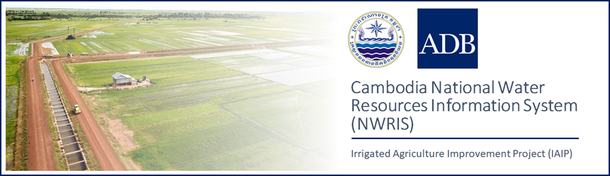
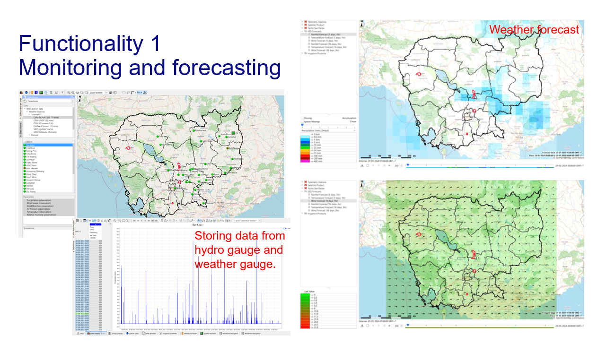
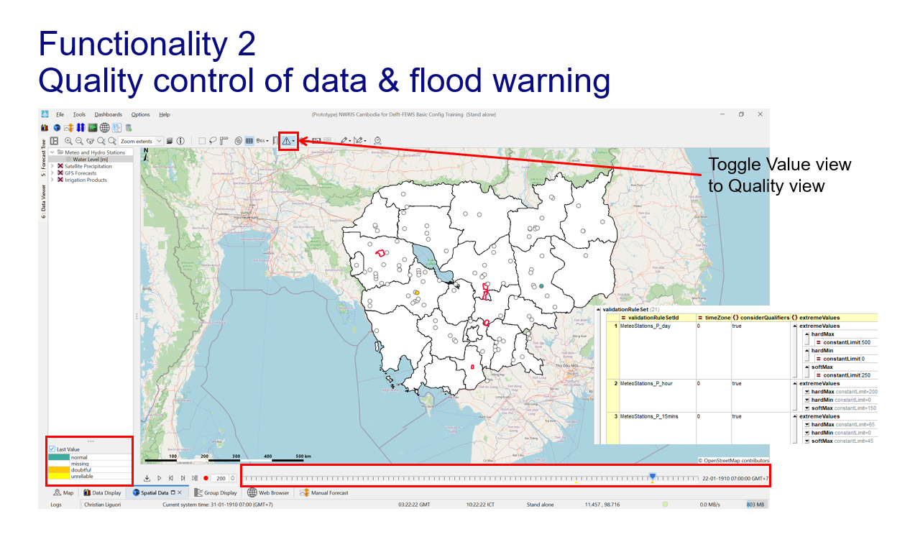
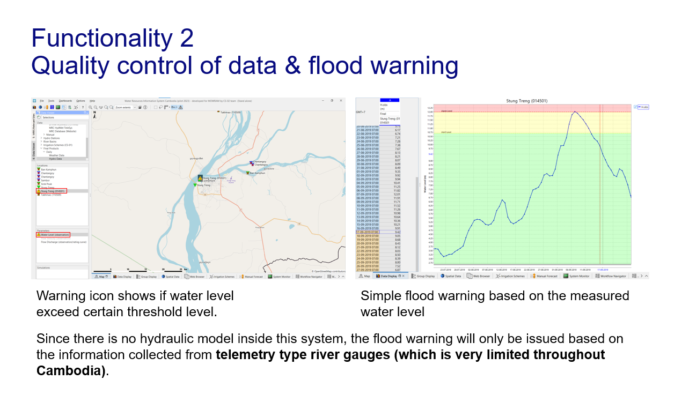
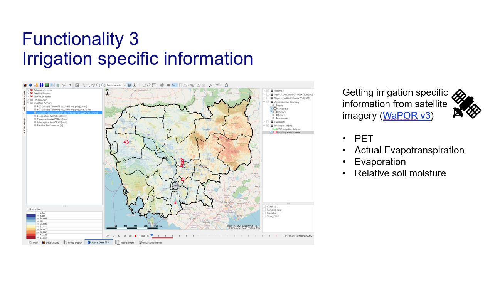
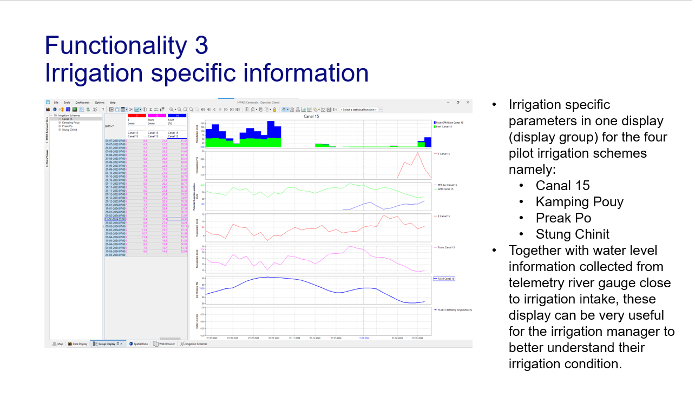
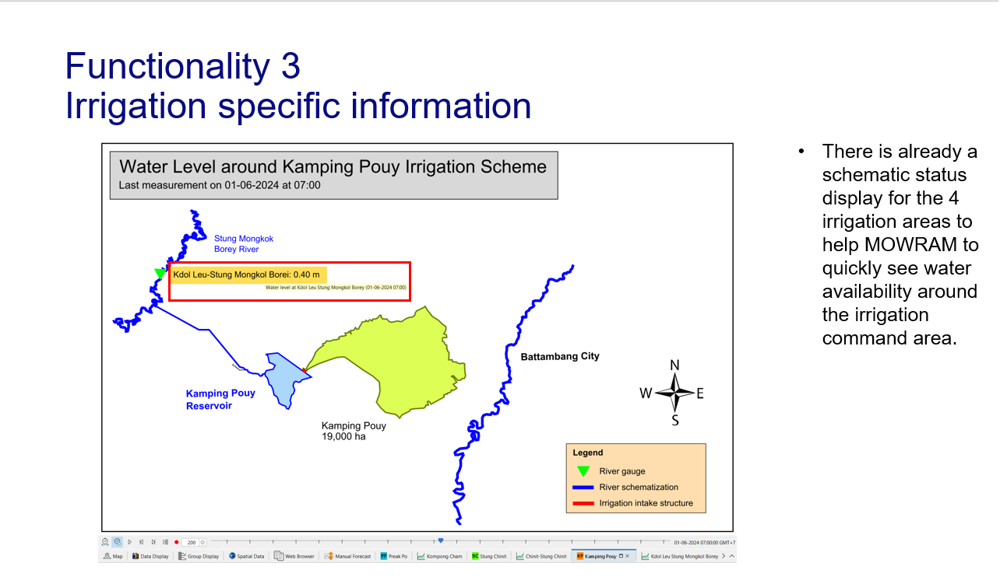
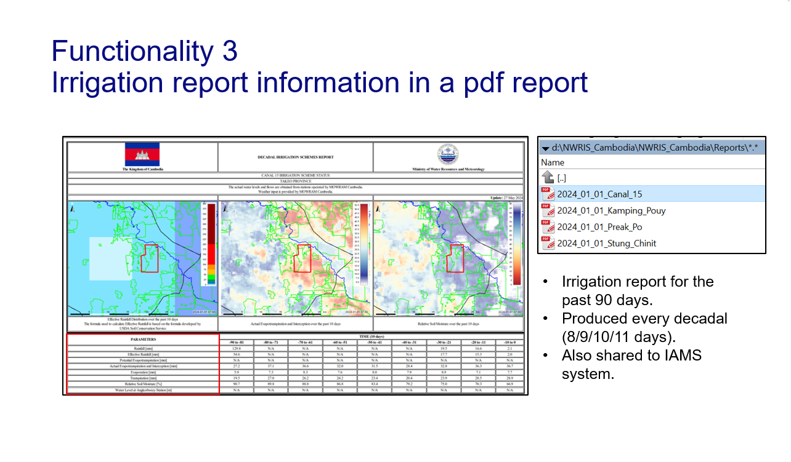
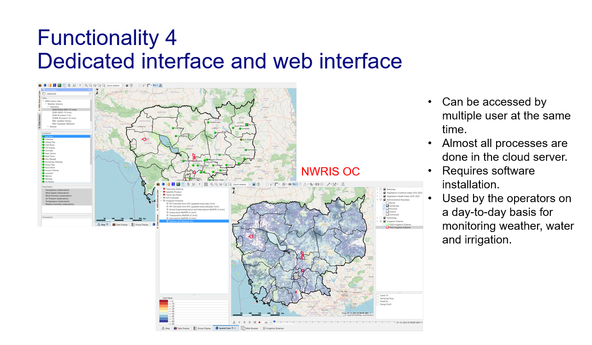
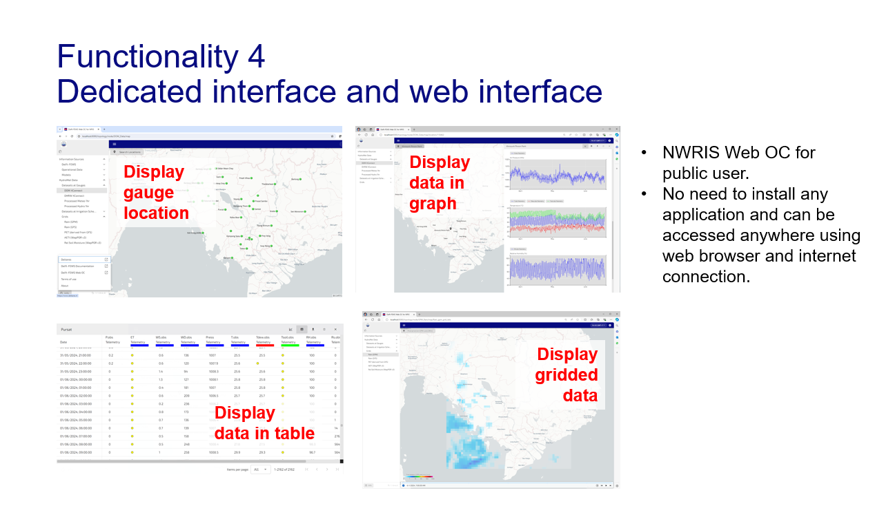

# Project Description

NWRIS Cambodia is a national water resource information system developed for Cambodia using the Delft-FEWS application. This system is designed to collect meteorological and hydrological data from various sources within the Ministry of Water Resources and Meteorology Cambodia (MOWRAM) as well as global data into a single, unified platform. The primary goal of the establishment of this system is to enhance water resource management in Cambodia. Additionally, the system is expected to support farming practices, boosting agricultural productivity, which is crucial for Cambodia's economy since 23% of the GDP comes from the agricultural sector.

In this project, I was the main developer of NWRIS Cambodia. The system currently integrates data from nine sources, including both MOWRAM's internal systems and global data sources. Over the course of 7.25 months, I not only developed the system but also provide training for MOWRAM staff to use and configure the system.

# System Features
1. Monitoring and forecasting
2. Quality control of data & flood warning
3. Irrigation specific information
4. Dedicated interface and web interface




